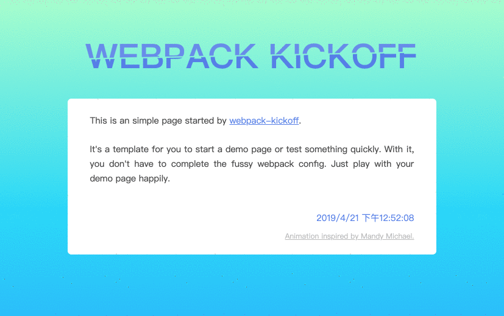

# create-WebRoll-app-template

Help you to quickly start a project based on [Webpack](https://webpack.js.org/).

In my work, I often need to start a tiny demo quickly to

- try an NPM library by `import`
- test/try a webpack plugin or loader
- ……

Without configuring Wepack, `generator-create-WebRoll-app` makes these more simple.

